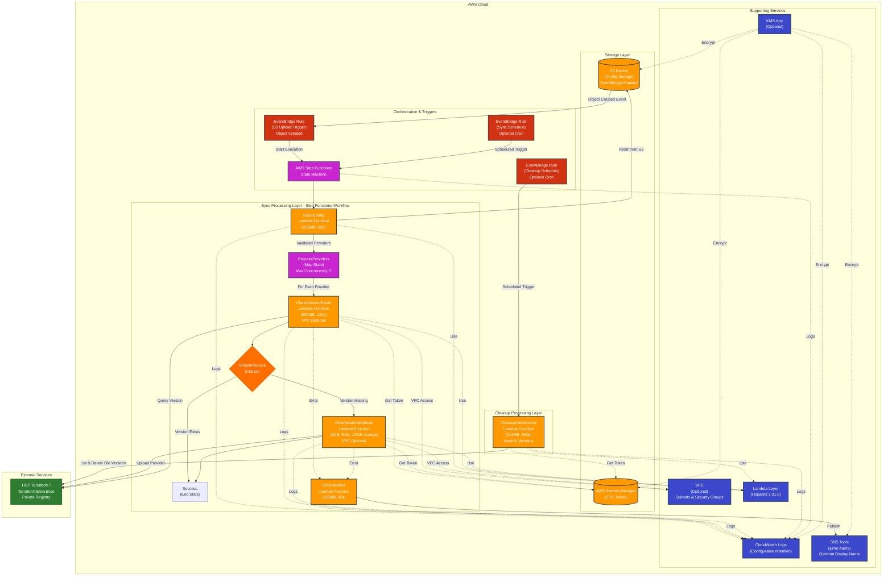

# Architecture Documentation

## Overview

The Terraform AWS Provider Synchronizer is a serverless AWS solution that automatically synchronizes Terraform providers from the public Terraform Registry to HCP Terraform or Terraform Enterprise private registries. The architecture leverages AWS Step Functions for orchestration and AWS Lambda for execution, enabling parallel processing of multiple providers.

## Architecture Diagram



## Components

### 1. AWS Step Functions State Machine

**Purpose**: Orchestrates the provider synchronization workflow with parallel processing capabilities.

**Key Features**:

- **Map State**: Processes multiple providers concurrently (max 5 parallel executions)
- **Error Handling**: Automatic retries with exponential backoff
- **Logging**: CloudWatch Logs integration for execution tracking
- **Tracing**: AWS X-Ray integration for performance monitoring

**States**:

1. `ReadConfig`: Reads and validates provider configurations from S3
2. `ProcessProviders`: Map state that parallelizes provider processing
3. `CheckVersionExists`: Verifies if provider version already exists
4. `ShouldProcess`: Decision point based on version existence
5. `DownloadAndUpload`: Atomic download and upload operation
6. `Success`: Workflow completion
7. `NotifyError`: Error notification handler

### 2. Lambda Functions

#### 2.1 ReadConfig Lambda

**Runtime**: Python 3.11  
**Memory**: 256 MB  
**Timeout**: 60 seconds

**Responsibilities**:

- Read `config.json` from S3 bucket
- Validate provider configurations (namespace, provider, platforms)
- Support both single provider object and array format
- Enrich configurations with extracted fields
- Return array of validated providers

**Input**: S3 bucket name and key from Step Functions
**Output**: Array of enriched provider configurations

#### 2.2 CheckVersion Lambda

**Runtime**: Python 3.11  
**Memory**: 256 MB  
**Timeout**: 120 seconds  
**VPC**: Optional (configurable via `vpc_subnet_ids` and `vpc_security_group_ids`)

**Responsibilities**:

- Retrieve TFC token from AWS Secrets Manager
- Query HCP Terraform/TFE API for version existence
- Resolve "latest" version to specific version number
- Support custom TFC_ADDRESS for Terraform Enterprise
- Optional VPC deployment for private network access

**Input**: Provider namespace, name, version, organization  
**Output**: `versionExists`, `resolvedVersion`, `shouldProcess` flags

#### 2.3 DownloadAndUpload Lambda

**Runtime**: Python 3.11  
**Memory**: 3008 MB  
**Timeout**: 900 seconds (15 minutes)  
**Ephemeral Storage**: 10 GB  
**VPC**: Optional (configurable via `vpc_subnet_ids` and `vpc_security_group_ids`)

**Responsibilities**:

- Download provider binaries from public Terraform Registry
- Verify SHA256 checksums
- Upload to HCP Terraform/TFE private registry
- Create provider, version, and platform resources via API
- Atomic operation (download and upload in single function)
- Optional VPC deployment for private network access

**Input**: Provider details, platforms, organization  
**Output**: Upload status, platform count, registry URL

**Note**: Uses Lambda Layer for `requests` library dependency.

#### 2.4 ErrorHandler Lambda

**Runtime**: Python 3.11  
**Memory**: 256 MB  
**Timeout**: 60 seconds

**Responsibilities**:

- Format error details into human-readable message
- Include provider information, error details, troubleshooting steps
- Publish notification to SNS topic
- Return notification status

**Input**: Error details from Step Functions execution  
**Output**: SNS message ID and notification status

#### 2.5 CleanupOldVersions Lambda

**Runtime**: Python 3.11  
**Memory**: 512 MB  
**Timeout**: 900 seconds (15 minutes)

**Responsibilities**:

- List all private providers in the organization
- Retrieve all versions for each provider
- Sort versions by semantic versioning (newest first)
- Keep the N most recent versions (configurable, default: 10)
- Delete older versions to reduce storage and clutter
- Support dry-run mode for testing without actual deletion
- Can target specific provider or clean all providers
- Uses correct HCP Terraform/TFE API endpoints:
  - `GET /organizations/:org/registry-providers`
  - `GET /organizations/:org/registry-providers/:registry/:namespace/:name/versions`
  - `DELETE /organizations/:org/registry-providers/:registry/:namespace/:name/versions/:version`

**Environment Variables**:

- `TFC_TOKEN_SECRET_NAME`: Secret name for TFC token
- `TFC_ORGANIZATION`: Organization name
- `TFC_ADDRESS`: HCP/TFE base URL
- `KEEP_VERSION_COUNT`: Number of versions to retain (default: 10)
- `DRY_RUN`: Enable dry-run mode (default: false)

**Input**: Optional `provider` filter in event  
**Output**: Summary with total providers checked, versions deleted, results per provider

**Trigger**: EventBridge scheduled rule (optional, configurable via `cleanup_cron_expression`)

### 3. Lambda Layer

**Purpose**: Provides shared `requests` library dependency for all Lambda functions.

**Contents**:

- `requests` and its dependencies
- Optimized for size (unnecessary files removed)

**Build Process**: Automated via Terraform `null_resource` with local-exec provisioner.

### 4. S3 Bucket (Configuration Storage)

**Purpose**: Stores provider configuration files and triggers Step Functions on upload.

**Features**:

- **Versioning**: Enabled for configuration history
- **Encryption**: Server-side encryption (AES256 or KMS)
- **Lifecycle Policy**: 90-day retention for non-current versions
- **Public Access**: Blocked by default
- **EventBridge Notifications**: Enabled to trigger Step Functions on config.json upload
- **Force Destroy**: Enabled for easy cleanup during terraform destroy
- **Ownership Controls**: BucketOwnerEnforced for ACL management

**Security Policies**:

- **TLS Enforcement**: Denies all S3 operations over non-TLS connections (HTTPS required)

**Configuration Format** (`config.json`):

```json
[
  {
    "provider": "github",
    "namespace": "integrations",
    "gpg-key-id": "38027F80D7FD5FB2",
    "version": "latest",
    "platforms": [{ "os": "darwin", "arch": "arm64" }]
  },
  {
    "provider": "aws",
    "namespace": "hashicorp",
    "gpg-key-id": "34365D9472D7468F",
    "version": "latest",
    "platforms": [{ "os": "darwin", "arch": "arm64" }]
  }
]
```

### 5. AWS Secrets Manager

**Purpose**: Securely stores HCP Terraform/TFE API token.

**Features**:

- **Encryption**: KMS encryption (customer-managed or AWS-managed key)
- **Access Control**: IAM policies restrict Lambda function access
- **Rotation**: Supports automatic secret rotation (manual setup required)

### 6. SNS Topic (Error Notifications)

**Purpose**: Sends email notifications for workflow failures.

**Features**:

- **Encryption**: Optional KMS encryption
- **Subscriptions**: Email endpoints configured externally
- **Message Format**: Detailed error information with troubleshooting steps
- **Display Name**: Optional custom display name for email notifications (configurable via `sns_topic_display_name`)

**Notification Content**:

- Provider details (namespace, name, version)
- Error message and stack trace
- Execution ID for investigation
- Troubleshooting suggestions

### 7. CloudWatch Logs

**Purpose**: Centralized logging for all Lambda functions and Step Functions.

**Features**:

- **Retention**: Configurable (default: 30 days, via `cloudwatch_logs_retention_days`)
- **Encryption**: Optional KMS encryption
- **Log Groups**: Separate groups per Lambda function and Step Functions

**Log Levels**: Configurable via `LOG_LEVEL` environment variable (DEBUG, INFO, WARNING, ERROR).

### 8. IAM Roles and Policies

#### Lambda Execution Role

**Permissions**:

- S3: Read access to configuration bucket
- Secrets Manager: Read access to TFC token secret
- CloudWatch Logs: Create log groups, streams, and put log events
- SNS: Publish messages to error topic
- KMS: Decrypt operations (if using customer-managed keys)
- VPC (Optional): EC2 network interface management (when VPC configured)

#### Step Functions Execution Role

**Permissions**:

- Lambda: Invoke all synchronization Lambda functions
- CloudWatch Logs: Write Step Functions execution logs
- X-Ray: Put trace segments

#### EventBridge Execution Role

**Permissions**:

- Step Functions: StartExecution for state machine
- Lambda: InvokeFunction for cleanup Lambda

### 9. VPC Configuration (Optional)

**Purpose**: Enable Lambda functions to run within a VPC for private network access.

**Supported Functions**: CheckVersion and DownloadAndUpload Lambda functions

**Configuration**: Controlled via `vpc_subnet_ids` and `vpc_security_group_ids` variables

**Requirements**:

- Private subnets with NAT Gateway or VPC endpoints for internet access
- Security groups allowing outbound HTTPS (443) to HCP/TFE and Terraform Registry
- VPC endpoints for AWS services (optional): S3, Secrets Manager, CloudWatch Logs

**IAM Permissions**: Lambda execution role includes EC2 network interface management when VPC is configured

### 10. KMS Keys (Optional)

**Purpose**: Customer-managed encryption for enhanced security.

**Encrypted Resources**:

- S3 bucket (configuration storage)
- SNS topic (error notifications)
- Secrets Manager secret (TFC token)
- CloudWatch Logs (all log groups)

**Configuration**: Controlled via `kms_key_id` Terraform variable.

### 11. EventBridge Rules (Triggers)

**Purpose**: Automate Step Functions and cleanup Lambda execution.

**Rules**:

1. **Sync Schedule Rule** (Optional)

   - Triggers: Step Functions state machine
   - Schedule: Configurable cron expression (`schedule_cron_expression`)
   - Example: `cron(0 2 * * ? *)` for daily at 2 AM UTC
   - Input: S3 bucket and config.json key

2. **S3 Upload Trigger Rule** (Always Active)

   - Triggers: Step Functions state machine
   - Event: S3 Object Created events for config.json
   - Automatically starts sync workflow when config is uploaded
   - Input: Extracted from S3 event (bucket and key)

3. **Cleanup Schedule Rule** (Optional)
   - Triggers: CleanupOldVersions Lambda function
   - Schedule: Configurable cron expression (`cleanup_cron_expression`)
   - Example: `cron(0 3 ? * SUN *)` for weekly on Sundays at 3 AM UTC
   - Purpose: Automatically remove old provider versions

## Data Flow

### Normal Execution Flow

```
1. Step Functions execution triggered (manually or scheduled)
   ↓
2. ReadConfig Lambda reads config.json from S3
   ↓
3. Configuration validated and enriched
   ↓
4. Step Functions Map state iterates over providers (max 5 parallel)
   ↓
5. For each provider:
   a. CheckVersion Lambda queries HCP/TFE API
   b. If version doesn't exist:
      - DownloadAndUpload Lambda downloads from public registry
      - Verifies checksums
      - Uploads to HCP/TFE private registry
   c. If version exists: Skip processing
   ↓
6. All providers processed
   ↓
7. Step Functions execution succeeds
```

### Error Handling Flow

```
1. Error occurs in any Lambda function
   ↓
2. Step Functions catches error (CatchAll state)
   ↓
3. ErrorHandler Lambda invoked with error details
   ↓
4. Error message formatted with provider context
   ↓
5. SNS topic publishes notification
   ↓
6. Email sent to subscribers
   ↓
7. Step Functions execution marked as failed (with notification sent)
```

### Cleanup Workflow Flow

```
1. EventBridge scheduled trigger (or manual invocation)
   ↓
2. CleanupOldVersions Lambda invoked
   ↓
3. Retrieve TFC token from Secrets Manager
   ↓
4. List all private providers in organization (or target specific provider)
   ↓
5. For each provider:
   a. List all versions via HCP/TFE API
   b. Sort versions by semantic versioning (newest first)
   c. Keep N most recent versions (configurable, default: 10)
   d. Delete older versions (or log for dry-run)
   ↓
6. Return summary with deletion counts and results
```

### Trigger Flow

```
[S3 Config Upload] → EventBridge S3 Rule → Step Functions State Machine → Sync Workflow
[Cron Schedule]    → EventBridge Sync Rule → Step Functions State Machine → Sync Workflow
[Cron Schedule]    → EventBridge Cleanup Rule → CleanupOldVersions Lambda → Version Cleanup
[Manual]           → AWS Console/CLI → Step Functions or Lambda → Execute Workflow
```

## Security Considerations

### 1. Authentication & Authorization

- **TFC Token**: Stored in AWS Secrets Manager, never in environment variables
- **IAM Roles**: Least privilege principle applied to all roles
- **API Access**: Token retrieved dynamically at runtime

### 2. Encryption

- **In Transit**: All API calls use HTTPS/TLS
- **At Rest**:
  - S3: Server-side encryption (AES256 or KMS)
  - Secrets Manager: KMS encryption
  - SNS: Optional KMS encryption
  - CloudWatch Logs: Optional KMS encryption

### 3. Network Security

- **Lambda VPC**: Optional VPC deployment for CheckVersion and DownloadAndUpload functions
- **S3 Access**: Private bucket with IAM-based access, TLS-only policy
- **S3 Encryption**: Enforced server-side encryption for all uploads
- **Secrets Access**: IAM policies restrict access to specific Lambda functions
- **VPC Requirements** (if enabled):
  - Private subnets with NAT Gateway for internet access
  - Security groups allowing outbound HTTPS to HCP/TFE and Terraform Registry
  - Optional VPC endpoints for AWS services

### 4. Auditing & Monitoring

- **CloudWatch Logs**: All function executions logged
- **Step Functions**: Execution history retained
- **AWS X-Ray**: Distributed tracing for performance analysis
- **CloudTrail**: API calls tracked (AWS account level)

## Scalability

### Concurrency

- **Step Functions Map State**: Max 5 concurrent provider processing
- **Lambda Concurrency**: Default account limits apply (1000 concurrent executions)
- **Download/Upload Lambda**: High memory (3 GB) and storage (10 GB) for large providers

### Throughput

- **Provider Processing**: Up to 5 providers simultaneously
- **Platform Processing**: Sequential per provider (API rate limits)
- **Batch Size**: No hard limit on config array size

### Cost Optimization

- **Lambda Memory**: Right-sized per function (256 MB - 3 GB)
- **Lambda Timeout**: Appropriate timeouts prevent hanging executions
- **S3 Lifecycle**: Old configuration versions auto-deleted after 90 days
- **CloudWatch Logs**: 7-day retention reduces storage costs

## Monitoring & Troubleshooting

### Key Metrics

- **Step Functions Executions**: Success/failure rate
- **Lambda Duration**: Execution time per function
- **Lambda Errors**: Error count and types
- **Lambda Throttles**: Concurrency limits hit

### Troubleshooting

1. **Check CloudWatch Logs**: Review Lambda execution logs
2. **Step Functions Console**: View execution graph and state transitions
3. **SNS Notifications**: Error emails contain execution IDs
4. **X-Ray Traces**: Analyze performance bottlenecks

### Common Issues

- **Version Already Exists**: Check `shouldProcess` flag in CheckVersion output
- **Download Failures**: Verify internet connectivity and registry availability
- **Upload Failures**: Check TFC token permissions and API rate limits
- **Timeout**: Increase Lambda timeout for large providers

## References

- [Terraform Registry Provider Protocol](https://www.terraform.io/docs/registry/providers/publishing.html)
- [HCP Terraform API Documentation](https://www.terraform.io/cloud-docs/api-docs)
- [AWS Step Functions Developer Guide](https://docs.aws.amazon.com/step-functions/)
- [AWS Lambda Developer Guide](https://docs.aws.amazon.com/lambda/)
